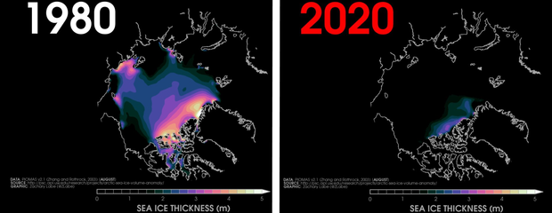

The [Arctic Data Center](https://arcticdata.io/) is a place for researchers from around the world working in the Arctic to efficiently share, discover, access, and interpret complex data about the Arctic with less effort. Part of our mission is to provide hands on training at Arctic research conferences and in dedicated training sessions targeting Arctic researchers, especially early-career and under-represented populations. In 2020, we were able to support the development of undergraduate-level educational materials through our fellowship program. These materials are open source and available for reuse and/or modification either at the associated GitHub repository, the [Arctic Data Center Training page](http://training.arcticdata.io/), or the [DataOne Skillbuilding Hub](https://dataoneorg.github.io/Education/).

With over 5,700 datasets in the Arctic Data Center repository, these education modules are intended to equip students with the necessary tools and resources to unearth the story behind the data, one about one of the planet’s fastest-changing ecosystems: the Arctic.

Encompassing Earth’s northern most region, the Arctic is an icy sea surrounded by land characterized by a harsh climate with extreme variation in light and temperature. Diverse landscapes—from the sea ice to coastal wetlands, upland tundra, mountains, wide rivers, and the sea itself—support abundant wildlife and many cultures making the Arctic a region like no other in the world.

### However, what happens in the Arctic doesn’t stay in the Arctic.

The Arctic is warming twice as fast as the global average. The cause of such rapid warming is straightforward and well understood: It is human-caused climate change, and it is altering the relative amount of the Sun's energy that is absorbed, reflected, or radiated in the Arctic. 

{width=70%}

According to [15th annual NOAA Arctic Report Card](https://arctic.noaa.gov/Report-Card/Report-Card-2020), the sea-ice extent in October of 2020 dropped to the lowest levels on record. Dramatic drops in Arctic ice like this are the main driver for rapid Arctic changes. Effects of a warming atmosphere on physical, chemical, biological, and human components of Arctic ecosystems are myriad, far-reaching, and accelerating. There is no facet of Arctic life that will remain untouched by the immensity of these changes.

Studying and understanding the Arctic is essential txo saving it, and ultimately ourselves. The Arctic Data Center repository is rich with real-world Arctic data just waiting to be explored. If you're ready to learn how, let's get started.

[{width=20%}](05-overview.html)

###### The National Wildlife Federation put together this [Activity Guide](https://www.nwf.org/~/media/PDFs/Be%20Out%20There/Schoolyard%20Habitats/ArcticEnvironment.pdf) if you'd like to learn more about the Arctic and climate change.

